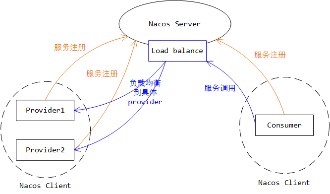
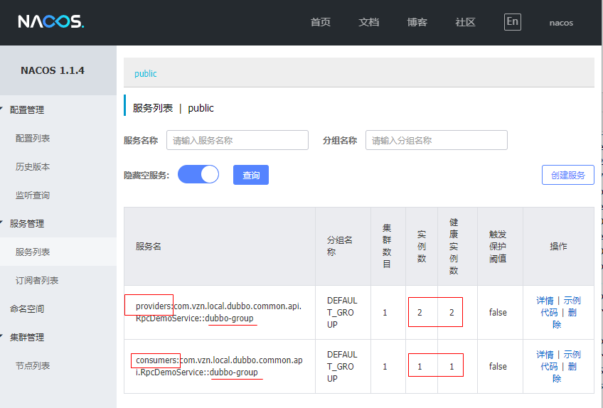

* content
{:toc}

`Nacos`是阿里开源的配置和服务管理的中间件。`Nacos`提供了一组简单易用的特性集，帮助您快速实现动态`服务发现`、`服务配置`、`服务元数据及流量管理`。


更多详细介绍，参见[官方介绍](https://nacos.io/zh-cn/docs/what-is-nacos.html)

## 1 Nacos的生态情况

当前微服务生态系统中，各种中间件太多，很多中间件都在尝试报团取暖，提供相互之间的支持与协作，形成完整的生态。

Nacos作为后来者，实现了与主流开源生态之间的无缝支持。典型地、`Nacos`可以与`SpringCloud`进行配套对接，替换`Eureka`作为注册中心；也可以和`Dubbo`无缝对接，替代`zookeeper`作为服务`注册管理中心`，以及`配置下发中心`等。

## 2 Nacos的优势在哪

看到这里，会有一个疑问，既然有这么多的组件可以用来选择作为注册中心或者配置中心，那么nacos的优势在哪？出于哪些方面的考虑，可以优先将Nacos作为选择的对象呢？

下面从几个方向进行简单的分析。

### 2.1 SpringCloud生态：Nacos Vs Eureka

比较详细的对比，参见：[nacos与eureke的比较](http://www.pianshen.com/article/8646198661/)

### 2.2 Dubbo的注册中心：Nacos Vs ZooKeeper

毫无疑问，**Nacos比ZooKeeper更适合做注册中心**。为什么这么说呢？下面简单分析下。

分布式系统`CAP理论`指出，**一个分布式系统不可能同时满足C(一致性)、A(可用性)和P(分区容错性)**。由于分区容错性在是分布式系统中必须要保证的，因此我们只能在`A`和`C`之间进行权衡

#### 2.2.1 ZooKeeper是个典型的CP系统

从CAP维度来看，`ZooKeeper`是一个典型的`CP系统`，强调数据的高度的一致性。

举个简单的例子：

> ZooKeeper集群中，当master节点挂了后，集群需要重新选举，而在此时，如果服务过来调用zookeeper来获取服务时，zookeeper是不可用的，这就直接影响到了业务的正常运行。


#### 2.2.2 注册中心更应该是个AP系统

而作为一个分布式系统的注册中心，是绝对不允许出现注册中心不可用、导致服务之间无法调用的问题的。而对于服务注册中心而言，短暂的数据不一致，对整个分布式系统的影响是有限的，可接受的。

举个例子：
> 正常情况应该是3个节点中间负载均衡，结果数据出现短暂偏差，请求在2个节点中进行负载均衡了。

相比整个系统服务不可用而言，这种负载均衡不完全的影响，是更容易接受的。

因此，服务注册中心，应该是一个`AP系统`，强调高度可用性。

#### 2.2.3 对比汇总

基于上述2点分析，ZooKeeper作为CP系统，其实不太合适作为注册中心，而`Nacos`是按照`AP系统`进行设计实现的。所以比较下来，**Nacos比ZooKeeper更适合作为注册中心**。

## 3 Nacos的较大制约因素在哪？

* 1. 中小规模场景

      对于一般中小型公司而言，或者一些简单的、重要性不是很高的系统而言，可以考虑试用下nacos简化下整体的开发复杂度。


* 2. 大型规模场景

      对于大型公司，或者非常重要的项目而言，可能会考虑到选择的开源组件的后续`可维护性`、`稳定性`等方面，由于Nacos开源的时间较短，社区热度还远不及Eureka等老牌组件，且可能依旧存在些许bug在修改迭代中，这些因素很大程度上制约着选择Nacos的可能性。

作为国内软件开发领域的巨头，阿里在开源方面的实例是有目共睹的。Nacos作为阿里开源范畴内的一个重磅产品，后续的前景**应该**是比较明朗的（但是阿里放弃的开源项目也不少~），所以Nacos的未来还是值得期待的。


## 4 使用篇： Dubbo使用Nacos作为服务注册管理中心

### 4.1 pom.xml中引入Nacos依赖

```xml
<!-- https://mvnrepository.com/artifact/org.apache.dubbo/dubbo-registry-nacos -->
<dependency>
    <groupId>org.apache.dubbo</groupId>
    <artifactId>dubbo-registry-nacos</artifactId>
    <version>2.7.4</version>
</dependency>
<!-- https://mvnrepository.com/artifact/com.alibaba.nacos/nacos-client -->
<dependency>
    <groupId>com.alibaba.nacos</groupId>
    <artifactId>nacos-client</artifactId>
    <version>1.1.4</version>
</dependency>
<dependency>
    <groupId>com.alibaba.spring</groupId>
    <artifactId>spring-context-support</artifactId>
    <version>1.0.2</version>
</dependency>
```

### 4.2 application.properties中增加地址配置

```properties
dubbo.registry.address=nacos://172.31.236.126:8848
```

### 4.3 provider按照正常SpringBoot方式提供controller接口

```java
@RestController
@RequestMapping("/demo/dubbo/provider")
public class RpcController {
    private static final Logger LOG = LoggerFactory.getLogger(RpcController.class);

    @Resource(name = "rpcDemoService")
    private RpcDemoService rpcDemoService;

    @GetMapping("/get/time/{requestId}")
    public String getTime(@PathVariable("requestId") String requestId) {
        String time = rpcDemoService.queryCurrentTime(requestId);
        return time;
    }
}
```

其中，注入的rpcDemoService服务定义的时候，使用`@org.apache.dubbo.config.annotation.Service`指定了group值为`dubbo-group`，这样如果有多个provider进程注册到nacos中，会自动按照负载均衡的方式分发客户端的请求到各个provider上面。

```java
@Component("rpcDemoService")
@Service(timeout = 5000, group = "dubbo-group")
public class RpcDemoServiceImpl implements RpcDemoService {

    @Value("${spring.application.name}")
    private String serviceName;

    @Override
    public String queryCurrentTime(String queryId) {
        SimpleDateFormat simpleDateFormat = new SimpleDateFormat("yyyy-MM-dd HH:mm:ss.SSS");
        String formattedDate = simpleDateFormat.format(new Date());
        System.out.println(serviceName + "----" + queryId + " called, current time is: " + formattedDate);
        return serviceName + "|" + queryId + "|" + formattedDate;
    }
}
```

### 4.4 consumer中的调用

```java
@RestController
@RequestMapping("/demo/dubbo")
public class RpcController {

    @Resource(name = "rpcConsumerService")
    private RpcConsumerService service;

    @GetMapping("/get/time")
    public String getTime() {

        int provider1Count = 0;
        int provider2Count = 0;

        for (int i = 0; i < 100; i++) {
            String time = service.getTime("1");
            if (time.contains("provider1")) {
                provider1Count++;
            } else {
                provider2Count++;
            }
        }

        String result = "provider1 call count: " + provider1Count
                + "<br>" + "\r\n"
                + "provider2 call count: " + provider2Count;
        System.out.println(result);

        return result;
    }
}
```

其中，rpcConsumerService的具体实现逻辑如下, 通过`@org.apache.dubbo.config.annotation.Reference`指定了远端服务对应的group信息（也即前面provider中指定的group值），这样客户端的请求会在此group中进行负载均衡。

```java
@org.springframework.stereotype.Service
public class RpcConsumerService {
    @Reference(group = "dubbo-group")
    private RpcDemoService rpcDemoService;

    public String getTime(String requestId) {
        return rpcDemoService.queryCurrentTime(requestId);
    }

}
```

### 4.5 Nacos服务端部署

[官网下载](https://nacos.io/zh-cn/docs/quick-start.html)压缩包，解压后，执行bin目录的脚本即可启动服务端进程，默认端口号8848，如果被占用，可以到conf目录中application.proerties文件中修改。


### 4.6 测试验证

启动Nacos服务进程、1个Dubbo consumer进程，2个Dubbo provider进程进行测试。整体的组网情况如下所示：



通过`http://localhost:8848/nacos/`打开Nacos的管理界面，可以看到注册的服务信息如下：



通过`http://localhost:28812/demo/dubbo/get/time/`触发consumer向provider发起100次调用请求，查看下请求被分配到2个provider上的情况如下：

```
provider1 call count: 47
provider2 call count: 53
```

从验证结果上看，基本上是在group中的多个provider之间进行负载均衡分发请求的。
